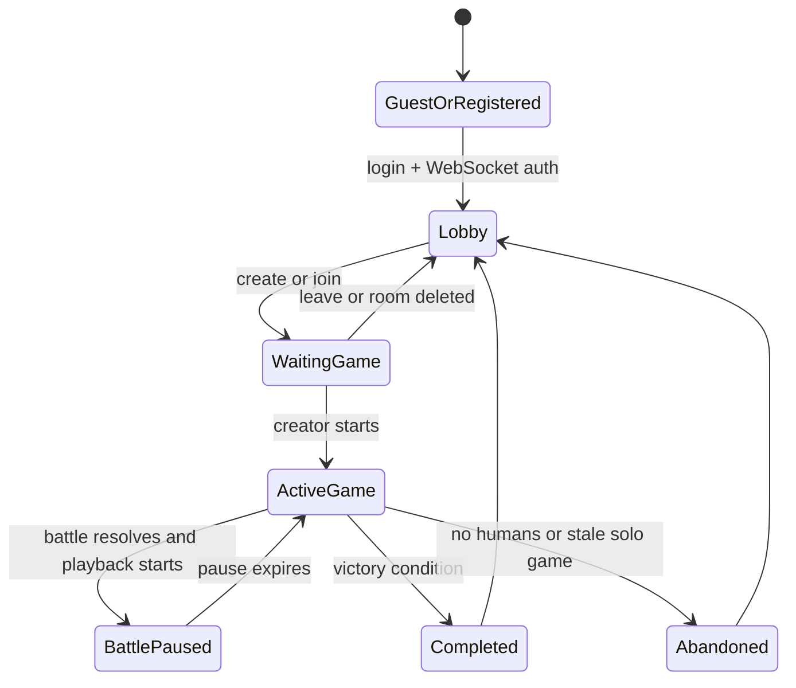

# State Model

Primary source: `server/server.js` `gameState` plus MySQL tables.

## Runtime State

`server/server.js` exports and shares:

```js
const gameState = {
  clients: [],
  clientMap: {},
  gameTimer: {},
  turns: {},
  activeGames: {},
  battlePause: {}
};
```

| Field | Owner | Meaning |
| --- | --- | --- |
| `clients` | WebSocket layer | All connected WebSocket connections. |
| `clientMap` | Auth layer | User id -> current connection. |
| `gameTimer` | Turn engine | Game id -> interval handle. |
| `turns` | Turn engine | Game id -> current turn number. |
| `activeGames` | Lobby/turn engine | Runtime metadata: mode, status, creator, AI profiles, standing orders, readiness, map size, authoritative `turnEndsAt`, and current/failed `turnResolution`. |
| `battlePause` | Combat/turn engine | Game id -> pause timer while battle playback is shown. Must be cleared on completed or abandoned games. |

Runtime state is reconstructed on process start by `resumeActiveGamesFromDatabase()`, which loads started games and restarts turn timers when human players remain.

Lobby seat reservations and mutation counters are separate in-process maps, not fields on `gameState`. They cover the gap between an accepted join/AI request and its visible `playersN` row, preventing over-capacity rooms and start/join overlap.

See `docs/agents/server/persistence.md` for table schema and lifecycle details.

## Persistent State

Core global tables:

| Table | Purpose |
| --- | --- |
| `users` | Account, guest identity, tempKey, current game. |
| `user_stats` | Progression and unlock stats. |
| `games` | Lobby/game row, creator, max players, status, started flag, mode, map size, turn, and recoverable turn-phase marker. |
| payment tables | Premium purchases, transactions, subscriptions, crystal balance. |

Per-game tables are suffixed with the numeric game id:

| Table Pattern | Purpose |
| --- | --- |
| `players<gameId>` | Player resources, race, tech CSV, homeworld/current sector, AI flags, at-most-once `last_automation_turn`, and idempotent `last_income_turn`. |
| `map<gameId>` | Sector type, owner, resources, terraform requirement, artifacts. |
| `ships<gameId>` | Individual ships by owner, type, sector. |
| `buildings<gameId>` | Buildings by owner, sector, type. |
| `explored_sectors<gameId>` | Fog-of-war memory per player. |
| `wonders<gameId>` | Victory/achievement structures. |

## Client State

The client stores local rendering and selection state in `public/js/connect.js`, `GUI.js`, and related game UI modules. Server remains authoritative for resources, sector ownership, ships, buildings, tech, victory, and turns. Sector ownership is broader than world ownership: empty routes and secured asteroids can have `map<gameId>.owner`, but elimination requires the candidate to own at least one sector type `6-10` and every opponent to own none.

## State Transitions



## Invariants To Preserve

- A WebSocket connection must authenticate before any command handler can mutate game state.
- `clientMap[userId]` should point to the latest authenticated socket for that user; socket close handlers must not delete the map entry for a newer reconnect.
- Dynamic table names must only use server-validated numeric game ids.
- `users.currentgame` and `connection.gameid` should agree after join/reconnect and be cleared on leave/abandon where possible.
- A game timer should exist for each active started game, except during shutdown or immediate abandonment.
- Battle playback pauses the turn clock by using `battlePause`; do not advance turns while `isBattlePauseActive(gameId)` is true, and terminal cleanup must clear both the pause timeout and the map entry.
- Fog-of-war writes to `explored_sectors<gameId>` and should prevent hidden sectors from leaking through `sector::` or `mapstate::`.
- Production `/status.deploy.dirty` should be `false`; a dirty deploy indicates generated/tracked files or wrong checkout state in CI.
- `activeGames[gameId].turnReady` must be cleared after each processed turn.
- A turn with `turnResolution` must reject new mutations. `newturn::` is legal only after the persistent phase marker is cleared and awaited side effects finish.
- `activeGames[gameId].lastHumanActivityTurn` should advance when humans send authenticated game commands, otherwise stale-game abandonment can fire too aggressively.
- The browser clock is a projection of `activeGames[gameId].turnEndsAt`; reconnect snapshots and `turnclock::` must not fall back to a hard-coded quick-game duration.
- A terminal game must not retain `activeGames`, a turn timer, or a battle pause. The test-only invariant audit checks these alongside persisted ownership, resources, and references.
- State audits are read-only. Do not use `server/lib/sync.js` repair methods as a second gameplay mutation path; gameplay handlers remain authoritative.
