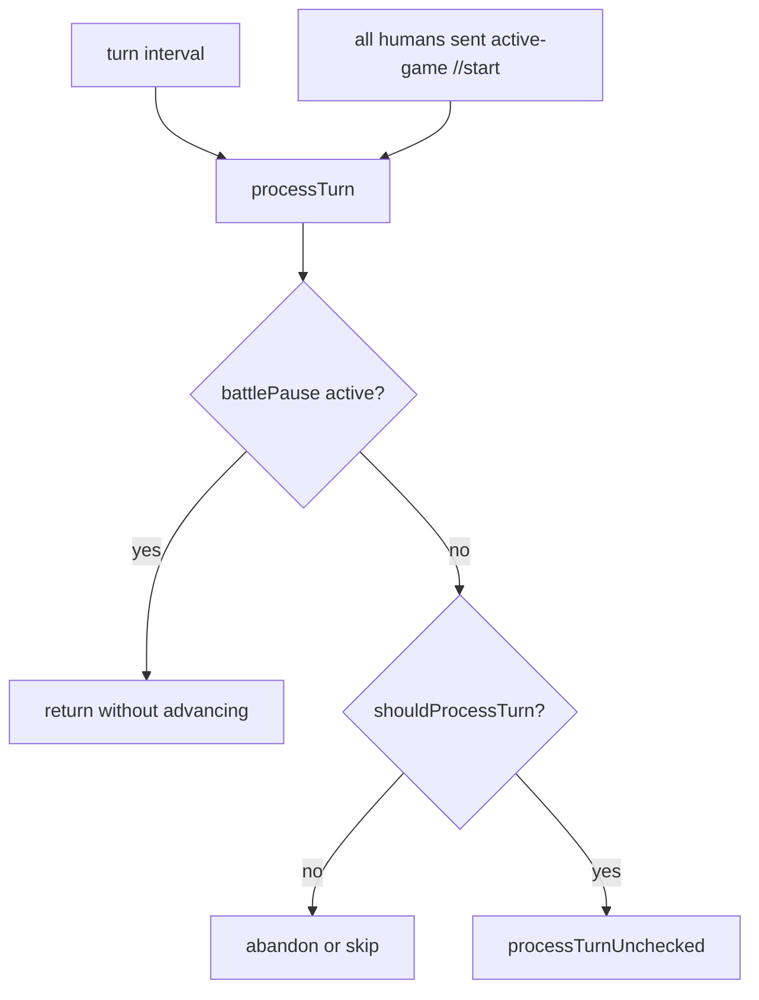

# Turn Resolution Flow

Primary source: `server/server.js` plus `server/lib/victory.js`.

This document describes the live server sequence for one active game turn. It is a map of current behavior, including async boundaries that matter when changing gameplay.

## Runtime Owners

| State | Owner | Cleanup Requirement |
| --- | --- | --- |
| `gameState.gameTimer[gameId]` | `startTurnTimer()` / battle pause / terminal cleanup | Clear on completed, abandoned, deleted waiting-room, and runtime reset paths. |
| `gameState.battlePause[gameId]` | `pauseTurnTimerForBattle()` | Clear on completed or abandoned games; do not leave a paused terminal game behind. |
| `gameState.turns[gameId]` | `processTurnUnchecked()` and resume/start paths | Delete when a game is completed or abandoned. |
| `gameState.activeGames[gameId]` | lobby/start/resume/gameplay helpers | Delete when a game is completed or abandoned. |
| `activeGames[gameId].turnResolution` | `processTurn()` | Freeze orders until success; retain failed phase for retry/reconnect. |
| `games.turn_phase` / `turn_phase_turn` | awaited turn pipeline | Clear before `newturn::`; use on startup to resume an interrupted phase. |

## Turn Entry Points

Manual end-turn uses the same `//start` command as game start after the game is already active. The server records readiness in `activeGames[gameId].turnReady`, broadcasts `turnready::<readyHumans>::<humanCount>`, and advances immediately once every human player is ready.

## `shouldProcessTurn()`

Before a turn mutates gameplay state, the server checks:

1. Player rows still exist.
2. At least one human player remains.
3. At least one human is connected, or the stale-human turn limit has not been reached.
4. Solo sandbox games have not reached `SOLO_SANDBOX_MAX_TURNS`.

Failures that mean the game should end call `abandonGame()`. Abandonment stops runtime state, marks `games.status = "abandoned"`, clears `users.currentgame`, sends `gameover::::<reason>`, and detaches connected clients.

## `processTurnUnchecked()`

Current sequence:

1. Atomically persist the next `games.turn` and the `automation` phase marker.
2. Set runtime resolution state and broadcast `turnphase::resolving`.
3. Clear manual readiness flags.
4. Reserve `last_automation_turn`, then trigger eligible AI actions.
5. Apply eligible standing orders under the same at-most-once reservation.
6. Await income/resource writes per player; each guarded write records `last_income_turn`.
7. Persist `battles`, then await conflict resolution.
8. Persist `victory`, then await victory checks and end-game bookkeeping.
9. Clear the persisted phase marker.
10. Broadcast `newturn::<turn>` and publish the next `turnclock::` deadline.

On a phase failure, no `newturn::` is emitted. Runtime retains the failed phase, clients remain frozen, and the server retries from that phase. Startup reconstructs the same retry from `games.turn_phase`; guarded income prevents duplicate payouts, while the automation reservation prevents duplicate AI/standing-order spending. A crash after automation reservation may skip unfinished automation for that player for one turn. AI mutations and standing orders are awaited before income begins.

## Battle Resolution

`processBattles()` finds sectors with ships from more than one owner and calls `resolveBattle()` for the first owner pair in each sector.

`resolveBattle()`:

1. Chooses attacker/defender; the sector owner defends when involved.
2. Loads fleet counts, race ids, tech, and defending orbital turrets.
3. Applies race combat modifiers and missile/shield interactions.
4. Runs `combatSystem.conductBattle()`.
5. Persists ship and turret losses.
6. Updates sector state.
7. Records combat telemetry.
8. Broadcasts `battlepause::<freezeMs>::<playbackMs>`.
9. Sends full or summarized battle playback based on stealth/force visibility.
10. Refreshes combatants' visible maps.

Battle pause clears the interval while clients play the battle. When the pause ends, the server restarts the turn timer only if `activeGames[gameId]` still exists.

## Victory And Terminal Cleanup

Victory checks live in `server/lib/victory.js`. Active conditions are:

- Domination
- Elimination
- Economic
- Scientific
- Time

When a winner is found, the caller sends `gameover::<winnerId>::<condition>` before `victorySystem.endGame()` does bookkeeping.

`endGame()`:

1. Marks runtime status completed.
2. Updates `games.status = "completed"` and `games.winner`.
3. Calculates scores.
4. Inserts `game_history`.
5. Updates `user_stats`.
6. Runs `cleanupGame()`.

`cleanupGame()` must stop the turn interval, clear any battle pause timeout, delete runtime `activeGames` and `turns`, clear reconnect pointers, and detach clients.

## Contributor Checks

- Any new terminal path must clear `gameTimer`, `battlePause`, `turns`, and `activeGames`.
- Any new turn-side effect should state whether it is awaited before `newturn::`.
- Any retryable phase mutation must be idempotent or guarded by a per-turn marker.
- If battle resolution changes, check both the `battlepause::` timing contract and combat telemetry.
- If victory timing changes, add tests that prove whether same-turn income/combat victories are expected.
