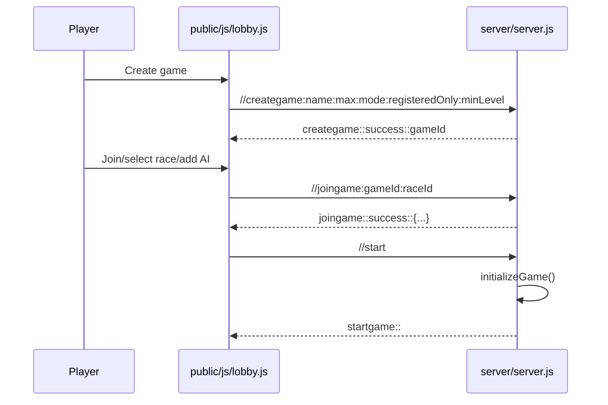

# User Journey

Primary sources: `public/js/lobby.js`, `public/js/connect.js`, `server/index.js`, `server/server.js`.

## New Or Returning Player

1. Browser loads `/landing.html` or `/login.html`.
2. Player registers, logs in, or continues as guest.
3. HTTP auth returns `userId`, `username`, `tempKey`, and guest metadata.
4. Browser stores auth cookies/local state and opens WebSocket.
5. First WebSocket message is `//auth:<userId>:<tempKey>`.
6. Server verifies `users.tempkey`.
7. If `users.currentgame` exists, server sends `currentgame::...`; otherwise it sends `lobby::` and `gamelist::...`.

## Lobby Flow

Lobby guardrails:

- Guests cannot create registered-only rooms.
- Non-creators cannot bypass registered-only or minimum-level gates.
- AI seats can only be added by the creator before game start.
- Race selection is checked against unlocks before join/change.

## Active Game Flow

1. `initializeGame()` creates/updates map, homeworlds, starting buildings, starting resources, and ships.
2. Server sends:
   - `startgame::`
   - `newturn::<turn>`
   - `mapconfig::<width>::<height>`
   - `mapstate::...`
   - `resources::...`
   - `techstate::...`
   - `empire::...`
   - `victoryprogress::...`
3. Player explores, probes, buys tech/buildings/ships, moves fleets, colonizes, and fights.
4. Each turn, `processTurn()` applies income, AI, standing orders, battle checks, victory checks, and broadcasts `newturn::`.

## Exploration Decisions

The intended core personality is risk/reward:

- Probe first: costs 300 crystal and can be destroyed by dangerous sectors or counter-intel, but avoids fleet risk.
- Move blind: faster and sometimes necessary, but black holes destroy fleets and unowned asteroid belts damage ships.
- Secure routes: owned asteroid belts become safe transit points.
- Colonize: colony ships settle unowned worlds if terraform requirements are met.

## End States

Games can end by:

- Victory condition from `server/lib/victory.js`.
- Surrender or elimination.
- No human players remain.
- Solo sandbox or stale-human limits.

End-state cleanup should stop timers, update `games.status`, notify clients, and clear current-game pointers where appropriate.
