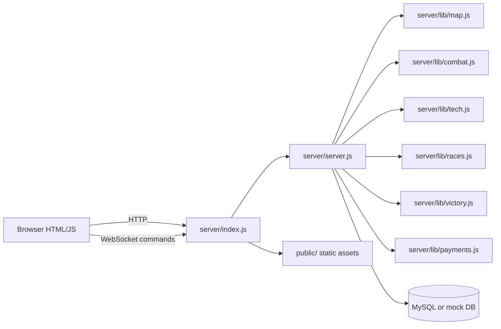

# Code Map

## Runtime Shape

## Live Server Files

| Path | Role | Notes |
| --- | --- | --- |
| `server/index.js` | Process entry point | Loads env, validates config, connects DB, serves HTTP, creates WebSocket server. |
| `server/server.js` | Main gameplay engine | Owns shared `gameState`, command handlers, turn loop, movement, battle, AI, standing orders. |
| `server/config/env-validator.js` | Env validation | Generates dev secrets when allowed; production must provide secrets. |
| `server/lib/mock-db.js` | In-memory test DB | Used by local smoke, unit tests, CI, and mock dev. |
| `server/lib/security.js` | Input and token utilities | Username/email/password validation, signed session tokens, CSRF helpers, rate limit helper. |
| `tools/deploy.js` | SSH deploy | Uploads `server/`, `public/`, package files, writes deploy metadata, restarts service, smokes server. |
| `tools/verify-production-status.js` | Public deploy verifier | Checks `/health` and `/status`; can require expected deployed commit. |

## Gameplay Modules

| Path | Responsibility |
| --- | --- |
| `server/lib/races.js` | Race definitions, unlock checks, race bonuses, ship access gates. |
| `server/lib/combat.js` | Ship definitions, battle simulation, battle timeline formatting. |
| `server/lib/tech.js` and `public/js/tech.js` | Mirrored tech-tree definitions and parsing. Keep changes synchronized. |
| `server/lib/map.js` | Galaxy map generation and sector/resource shape. |
| `server/lib/victory.js` | Victory conditions and completed-game persistence. |
| `server/lib/ai.js` plus AI block in `server/server.js` | AI profiles, strategic behavior, expansion, research, harassment. |
| `server/lib/movement/index.js` | Compatibility facade into `server/server.js`. |
| `server/lib/movement/hazards.js` | Legacy/phase hazard module. Shipped and documented, but live WebSocket movement is currently in `server/server.js`. |

## Client Files

| Path | Role |
| --- | --- |
| `public/js/lobby.js` | Lobby auth, game list, create/join/start, AI seats, race selection in lobby. |
| `public/js/connect.js` | In-game WebSocket connection, command sends, message parser, local game state. |
| `public/js/game.js`, `GUI.js`, `game-screen.js` | Game page boot and rendering coordination. |
| `public/js/build.js`, `tech.js`, `race-selection.js` | Feature panels and UI helpers. |
| `public/command-station-demo.html` and related CSS/JS | Standalone art-direction prototype, not integrated into live gameplay. |

## Known Legacy/Stale Areas

- Root deployment docs such as `DEPLOYMENT_GUIDE.md` and `MANUAL_DEPLOYMENT_STEPS.md` predate the GitHub Actions deploy flow. Prefer `docs/agents/operations/ci-cd.md`, `AGENTS.md`, and `tools/deploy.js`.
- `server/lib/movement/hazards.js` records the intended modular hazard design, but the active handler path is inside `server/server.js`.
- `server/server.js` is a large monolith. When changing behavior, identify the exported handler and all matching client message prefixes before editing.
