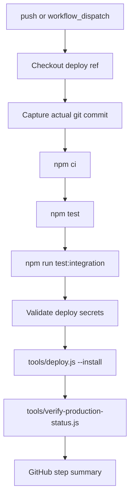

# CI/CD And Deploy

Primary sources:

- `.github/workflows/ci.yml`
- `.github/workflows/server-deploy.yml`
- `.github/workflows/deploy.yml`
- `tools/deploy.js`
- `tools/verify-production-status.js`

## Workflows

| Workflow | Trigger | Purpose |
| --- | --- | --- |
| `CI` | PRs and pushes to `stable`, `master`, `main` | Installs dependencies, runs unit tests, runs mock integration smoke. |
| `Server Deploy` | Pushes to deploy branches when app/server/deploy paths change, plus manual dispatch | Tests, deploys over SSH, restarts production, verifies public status. |
| `Deploy to GitHub Pages` | Pushes to `master`/`main`, plus manual dispatch | Publishes `public/` to GitHub Pages. |

## Server Deploy Flow

Server deploys share one production concurrency group. A newer deploy-branch push cancels a superseded in-progress run so an older job cannot overwrite or falsely reject a newer production commit during exact-SHA verification.



## Deploy Secrets

Repository secrets required:

- `PROD_SSH_HOST`
- `PROD_SSH_USER`
- `PROD_SSH_PASSWORD`

The workflow preflights these secrets before attempting SSH, and writes a failure summary when they are missing.

## Deploy Metadata

`tools/deploy.js` writes `server/deploy-info.json` to production. `/status` includes that metadata.

Important fields:

- `source`: `github-actions` or `local`.
- `branch`: deploy ref name.
- `commit`: actual checked-out commit from `git rev-parse HEAD` or `DEPLOY_COMMIT`.
- `runId`: GitHub Actions run id when deployed from Actions.
- `dirty`: whether the checkout had local changes at deploy metadata generation time.

Production should normally report `dirty: false`.

## Public Verification

`tools/verify-production-status.js` checks:

- `/health` returns JSON.
- `/status` returns JSON.
- `service` is `game-of-worlds`.
- `ok` is `true`.
- `status` is `ok`.
- database status is not `offline`.
- deploy metadata exists.
- deploy metadata says `dirty: false`.
- `deploy.commit` equals `EXPECTED_COMMIT` when provided.

Local usage:

```bash
node tools/verify-production-status.js
EXPECTED_COMMIT=$(git rev-parse HEAD) node tools/verify-production-status.js
```

## Debugging Failures

- If install/tests fail, inspect the named CI step first.
- If secret preflight fails, configure repository secrets.
- If SSH deploy fails, `tools/deploy.js` reports the failing remote command plus stdout/stderr.
- If public verification fails, compare `/status.deploy.commit` to the expected commit and check `database.status`.
- If `/status.deploy.dirty` is true, look for tracked generated files or Action steps that mutate tracked files before deploy.
