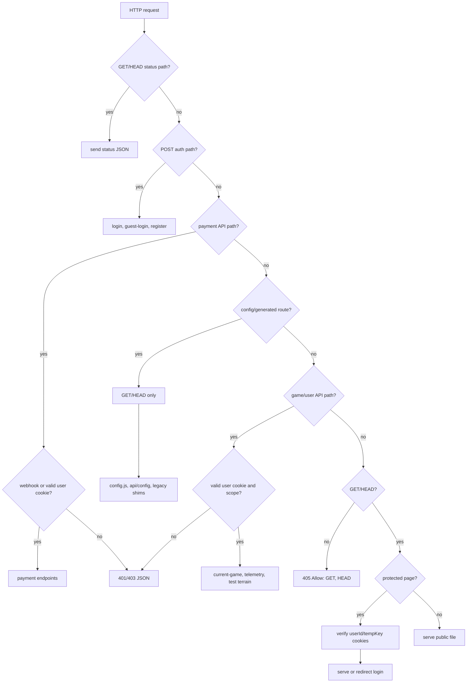

# HTTP Request Flow

Primary source: `server/index.js`.

This document maps HTTP request routing before requests reach WebSocket/gameplay handlers.

## Dispatch Order



## Generated And Legacy Routes

| Route | Notes |
| --- | --- |
| `/config.js` | Emits browser globals for Stripe publishable key and feature flags. No cache. |
| `/api/config` | JSON version of the same public config. No cache. |
| `/js/shop.js` | Deliberately disabled legacy script; returns `410`. |
| `/race-selection.js` | Compatibility alias for `public/js/race-selection.js`. |

These routes are not ordinary files at their URL path. Keep method handling explicit and test both `GET` and `HEAD` behavior when changing them.

## Static Method Contract

Only `GET` and `HEAD` should serve browser/static content. A non-API `POST` to a static path should return:

```text
405 Method Not Allowed
Allow: GET, HEAD
```

This keeps form/API mistakes from silently receiving HTML or generated JavaScript.

## Protected Page Contract

Protected pages:

- `/game.html`
- `/lobby.html`
- `/purchase-race.html`

The server checks `userId` and `tempKey` cookies against `users.tempkey` with timing-safe comparison. Invalid or missing credentials redirect to `/login.html`. This is not a full session system; the WebSocket still authenticates independently with `//auth:<userId>:<tempKey>`.

## JSON API Auth Contract

User-scoped JSON APIs, including payment reads and `/api/user/:id/current-game`, require the cookie `userId` to match the URL `:id` and the cookie `tempKey` to match `users.tempkey`.

Game-scoped JSON APIs, including combat telemetry and test terrain, require valid user cookies and a row for that user in the game's `playersN` table.

Payment write APIs read JSON bodies once with a 16 KB cap and require the body `userId` to match the authenticated cookie user. `/api/payment/webhook` is the exception; it is authenticated by Stripe signature.

## Contributor Checks

- New JSON APIs should be placed before the static method guard.
- New user/game JSON APIs should use the cookie/tempKey auth helpers and should add route-level smoke coverage.
- New generated browser routes should explicitly handle `GET` and `HEAD`.
- New protected pages should be added to the protected-page list and tested for unauthenticated redirects.
- Keep `server/test-server.js` smoke checks in sync with this dispatch map.
