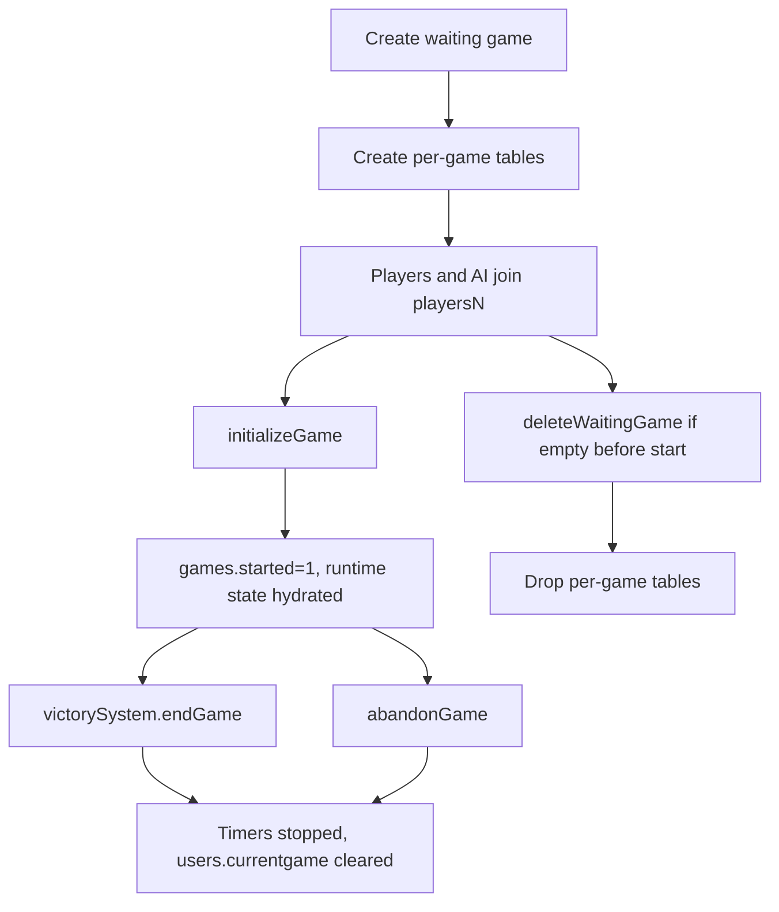

# Persistence Model

Primary sources: `server/setup.js`, `server/server.js`, `server/lib/mock-db.js`.

## Global Tables

| Table | Key columns used by live server | Notes |
| --- | --- | --- |
| `users` | `id`, `username`, `password`, `salt`, `email`, `tempkey`, `currentgame`, `is_guest`, `guest_token_hash` | HTTP auth writes `tempkey`; WebSocket auth reads it. `currentgame` is the reconnect pointer. |
| `user_stats` | `user_id`, progression/unlock fields | Race unlock and room level gates use this table. |
| `games` | `id`, `creator`, `maxplayers`, `started`, `status`, `winner`, `mode`, `turn`, `turn_phase`, `turn_phase_turn`, `mapwidth`, `mapheight`, access gates | Waiting/active lifecycle plus recoverable turn phase. |
| payment tables | balances, transactions, owned items, subscriptions | Optional. Payment endpoints must tolerate disabled Stripe config. |

## Per-Game Tables

The server creates per-game tables in `createGameTables(gameId)`.

| Pattern | Core columns | Purpose |
| --- | --- | --- |
| `players<gameId>` | `userid`, `race_id`, `is_ai`, `ai_difficulty`, `ai_strategy`, `metal`, `crystal`, `research`, `tech`, `homeworld`, `currentsector`, `last_automation_turn`, `last_income_turn` | Player economy/position; automation is at-most-once and income retry is idempotent. |
| `map<gameId>` | `sectorid`, `x`, `y`, `type`, `owner`, `metalbonus`, `crystalbonus`, `terraformlvl`, `artifact` | Galaxy sectors, ownership, terrain, resources. |
| `ships<gameId>` | `id`, `owner`, `type`, `sectorid` | One row per ship. Counts are derived by grouped queries. |
| `buildings<gameId>` | `id`, `sectorid`, `type`, `owner` | One row per building. Slot limits are enforced in code. |
| `wonders<gameId>` | `id`, `owner`, `type`, `turn_built` | Victory/achievement structure support. |
| `explored_sectors<gameId>` | `playerid`, `sectorid`, `discovered_at` | Fog-of-war memory. |

Dynamic table names are assembled through `server/lib/game-tables.js`. Because SQL placeholders cannot bind table names, `requireGameId()`, `gameTable()`, or `gameTables()` must validate every new suffix call site; unknown table bases and injection-shaped ids fail closed.

## Lifecycle

Completed and abandoned games keep or clear different persistence depending on path. Waiting games with no players are deleted and their per-game tables are dropped. Active games that end are marked with `status` and should stop timers and clear reconnect pointers. See `docs/agents/server/game-lifecycle.md` for the precise leave, surrender, completed, and abandoned cleanup flows.

## Runtime Reconstruction

On process start:

1. `server/index.js` connects the DB or installs mock DB.
2. `resumeActiveGamesFromDatabase()` selects started games not completed/abandoned.
3. Each game is abandoned if it has no human players.
4. Otherwise `restoreStartedGameRuntime()` hydrates `activeGames`, `turns`, map size, mode, AI profiles, and starts the turn timer.
5. If `games.turn_phase` is present, startup resumes that phase before announcing a completed new turn. `last_automation_turn` suppresses already-reserved AI/standing orders and `last_income_turn` suppresses already-applied income.

## Consistency Checks

- `users.currentgame` should agree with rows in `players<gameId>`.
- Connected sockets should have `connection.gameid` set only for the active/waiting game they are in.
- `clientMap[userId]` is a latest-socket pointer; an old socket closing must not clear a newer reconnect's entry.
- A game with `started=1` and non-terminal `status` should have runtime state after server resume.
- A game with no human players should not keep running forever.
- `explored_sectors<gameId>` controls what `mapstate::` and `sector::` may reveal.
