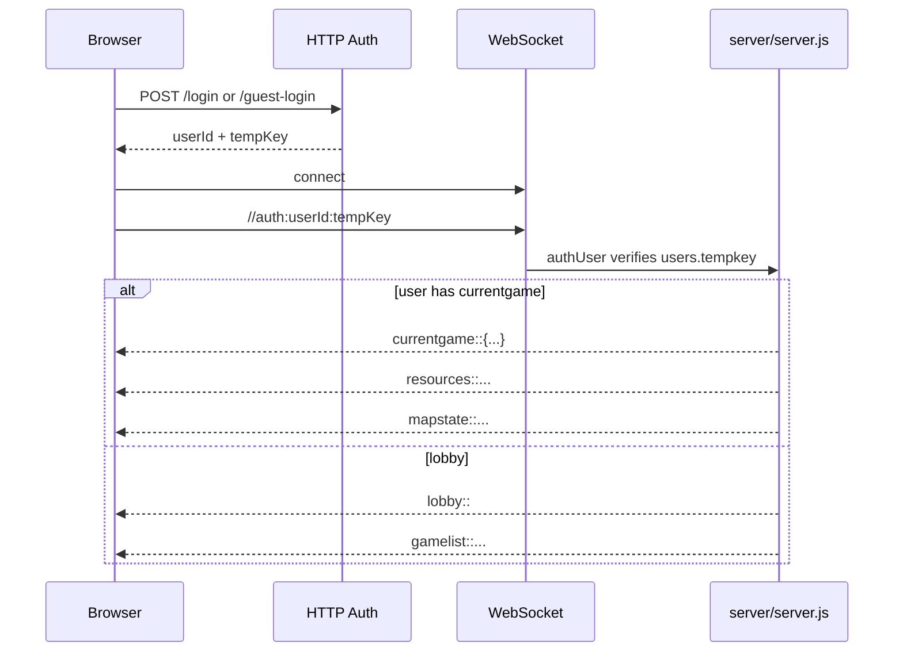

# WebSocket Protocol

Primary sources:

- Server accept/auth/dispatch: `server/index.js`
- Server command handlers: `server/server.js`
- Lobby client parser/sender: `public/js/lobby.js`
- Game client parser/sender: `public/js/connect.js`

## Connection Lifecycle



Unauthenticated sockets are closed unless their first UTF-8 message starts with `//auth:`.

See `server/signaling-and-errors.md` for the full bootstrap, error, and message-prefix inventory.

## Client Command Format

Client commands use a legacy text protocol:

```text
//command:arg1:arg2:...
```

The dispatch switch lives in `server/index.js` `handleCommand()`, then calls functions in `server/server.js`.

## Lobby Commands

| Command | Sent From | Server Handler | Purpose |
| --- | --- | --- | --- |
| `//gamelist` | lobby/game | `handleGameList` | Request waiting games. |
| `//currentgame` | lobby/game | `handleCurrentGame` | Request current game snapshot. |
| `//creategame:<name>:<max>:<mode>:<registeredOnly>:<minLevel>` | lobby | `handleCreateGame` | Create waiting room. |
| `//joingame:<gameId>:<raceId>` | lobby | `handleJoinGame` | Join waiting room. |
| `//leavegame` | lobby/game | `handleLeaveGame` | Leave waiting room or active game. |
| `//changerace:<raceId>` | lobby | `handleChangeRace` | Change selected race before start. |
| `//addai:<difficulty>:<strategy>` | lobby | `handleAddAi` | Creator adds AI seat. |
| `//start` | lobby/game | `handleGameStart` | Creator starts a waiting game; active-game players use the same command to mark turn ready. |
| `//getunlockedraces` | lobby | `handleGetUnlockedRaces` | Race picker data. |

## Game Commands

| Command | Server Handler | Notes |
| --- | --- | --- |
| `//update` | inline in `handleCommand` | Sends resources, tech, empire, victory, visible sectors. |
| `//sector:<sectorHex>` | `updateSector` | Requests sector detail if visible; may return `probeonly`. |
| `//probe:<sectorHex>` | `probeSector` | Costs 300 crystal, reveals or destroys probe on hazards/counter-intel. |
| `//colonize[:sectorHex]` | `colonizePlanet` | Uses colony ship, validates terraform requirement. |
| `//buyship:<shipId>` | `buyShip` | Requires resources, spaceport, race doctrine, and shipyard tech. |
| `//buybuilding:<buildingId>` | `buyBuilding` | Requires ownership, resources, sector slots, and tech for some buildings. |
| `//buytech:<techId>` | `buyTech` | Checks cost, prerequisites, and race branch caps. |
| `//techstate` | `handleTechStateRequest` | Returns `techstate::` JSON. |
| `//victoryprogress` | `handleVictoryProgressRequest` | Returns `victoryprogress::` JSON. |
| `//move:<fromHex>:<toHex>:<shipType>:<count>` | `moveFleet` | Adjacent or warp-gate movement, charges crystal, then arrival effects. |
| `//sendmmf:<payload>` | `preMoveFleet` | Multi-move fleet order. |
| `//mmove:<sectorHex>` | `surroundShips` | Multi-source movement helper. |
| `//standingorders:get` | `handleStandingOrders` | Reads automation settings. |
| `//standingorders:<json>` | `handleStandingOrders` | Updates automation settings. |
| `//applyorders` | `handleApplyStandingOrders` | Runs standing orders immediately. |
| `//surrender` | `handleSurrender` | Ends/removes player and may end game. |

Messages that do not begin with `//` are treated as chat text and broadcast to the sender's current game.

## Server Message Prefixes

| Prefix | Consumer | Meaning |
| --- | --- | --- |
| `$^$<count>` | lobby/game | Connected socket count. |
| `countdown::<seconds|cancel>` | lobby/game | Start-game countdown or cancellation. |
| `lobby::` | lobby/game | Enter lobby mode. |
| `gamelist::...` | lobby | Waiting-game list. |
| `currentgame::<json|null>` | lobby/game | Current game snapshot. |
| `creategame::success::<gameId>` / `creategame::error::<msg>` | lobby | Create result. |
| `joingame::success::<json>` / `joingame::error::<msg>` | lobby | Join result. |
| `changerace::success::<json>` / `changerace::error::<msg>` | lobby | Race result. |
| `addai::success::<name>` / `addai::error::<msg>` | lobby | AI-seat result. |
| `races::<json>` | lobby/game | Race unlock/selection data. |
| `playerlist::<json>` | lobby/game | Current players in game fallback/legacy shape. |
| `pl:<payload>` | lobby/game | Current player-list payload used by current clients. |
| `startgame::` | game | Switch to active game UI. |
| `turnready::<ready>::<humans>` | game | Manual end-turn readiness count. |
| `newturn::<turn>` | game | Turn advanced. |
| `resources::<metal>::<crystal>::<research>` | game | Player resources. |
| `techstate::<json>` | game | Tech tree state. |
| `empire::<json>` | game | Owned sectors/buildings/fleets summary. |
| `victoryprogress::<json>` | game | Victory progress. |
| `mapconfig::<width>::<height>` | game | Map dimensions. |
| `mapstate::<csv>` | game | Visible map snapshot. |
| `sector::<sectorId>::<json>` | game | Sector detail. |
| `probeonly:<sectorHex>` | game | Sector is not visible; probing is possible. |
| `mmoptions:<target>:...` | game | Multi-source move options. |
| `fleetmove::<from>::<to>::<player>::<count>::<warpFlag>` | game | Fleet movement animation/event. |
| `battlepause::<freezeMs>::<playbackMs>` | game | Turn timer is paused during battle playback. |
| `battle::...`, `battlereport::...`, `battle_summary::...` | game | Battle playback and telemetry. |
| `gameover::...` | game/lobby | Game end. |
| `standingorders::state::<json>` / `standingorders::applied::<json>` / `standingorders::error::<msg>` / `standingorders::noop` | game | Standing order state/results/errors. |
| `systemalert::<msg>` | game | Important narrative/system update. |
| `maxbuild::`, `ownsector:`, `fleet:`, `tech:`, `ub:`, `info:` | game | Legacy/current compatibility messages still parsed by `public/js/connect.js`. |

## Protocol Risks

- The protocol is string-prefix based. Add tests whenever introducing a new prefix or changing delimiters.
- Some arguments are hex sector tokens. Server parsing should use `parseSectorToken()` or equivalent and never trust raw table suffixes.
- Client parsing is split between lobby and game scripts, so new server messages may need two client handlers.
