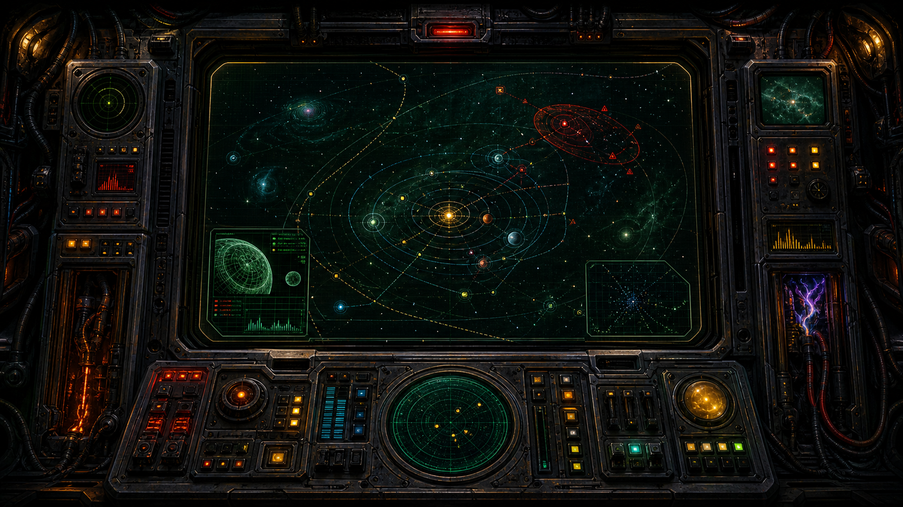
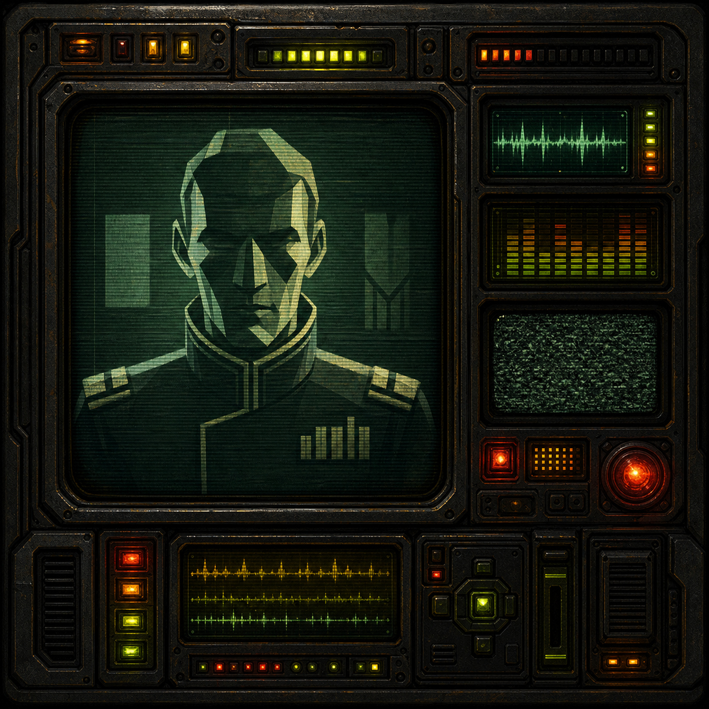
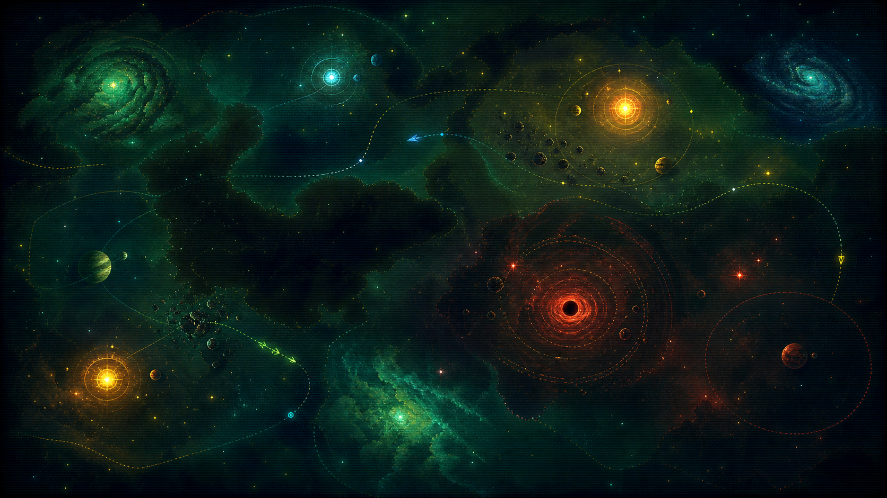

# Concept Bitmaps

These are original generated concept images for art-direction inspiration. They are not production UI and should not be treated as final assets.

Use them to discuss composition, lighting, mood, and motion targets. Production assets should be rebuilt intentionally for the actual game layout.

## Images

`command-console-concept.png`

- Fixed command-station shell.
- Central tactical star-map monitor.
- Side instrument stacks and lower controls.
- Good reference for "permanent installed interface."

`commander-feed-concept.png`

- Embedded talking-head/status-feed panel.
- Stylized non-identifiable advisor portrait.
- Waveform, static, lamps, scanlines, and alert affordances.
- Good reference for event narration and commander briefings.

`living-space-map-concept.png`

- Painterly 2D tactical space field.
- Stars, galaxies, suns, planets, black-hole hazard, fog, and fleet paths.
- Good reference for shader-assisted map atmosphere.

## Generation Notes

Generated with the built-in image generation tool as original concept references. Prompts asked for a 1990s pre-rendered sci-fi bitmap feeling with modern polish, explicitly avoiding copied franchise elements, logos, readable text, low-poly battle scenes, and realistic 3D model showcases.
