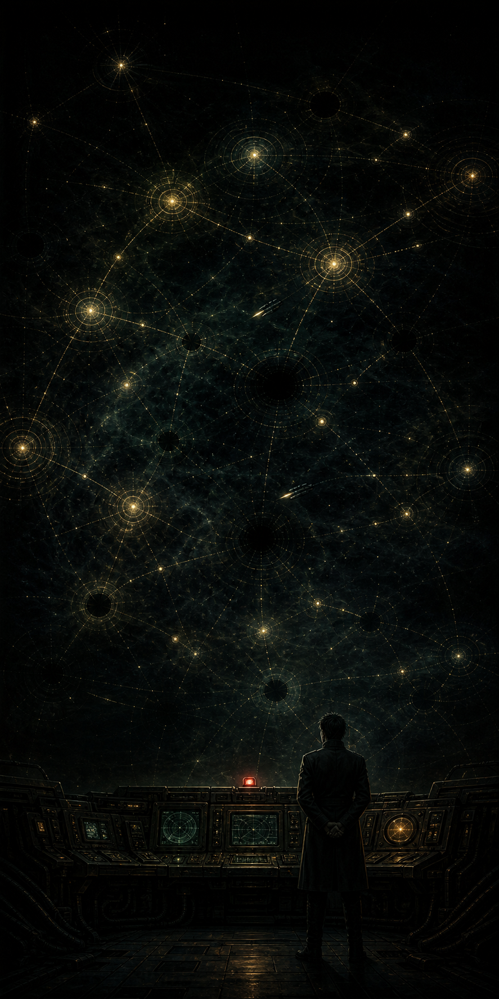
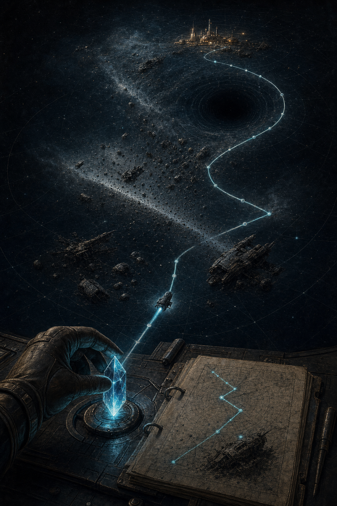
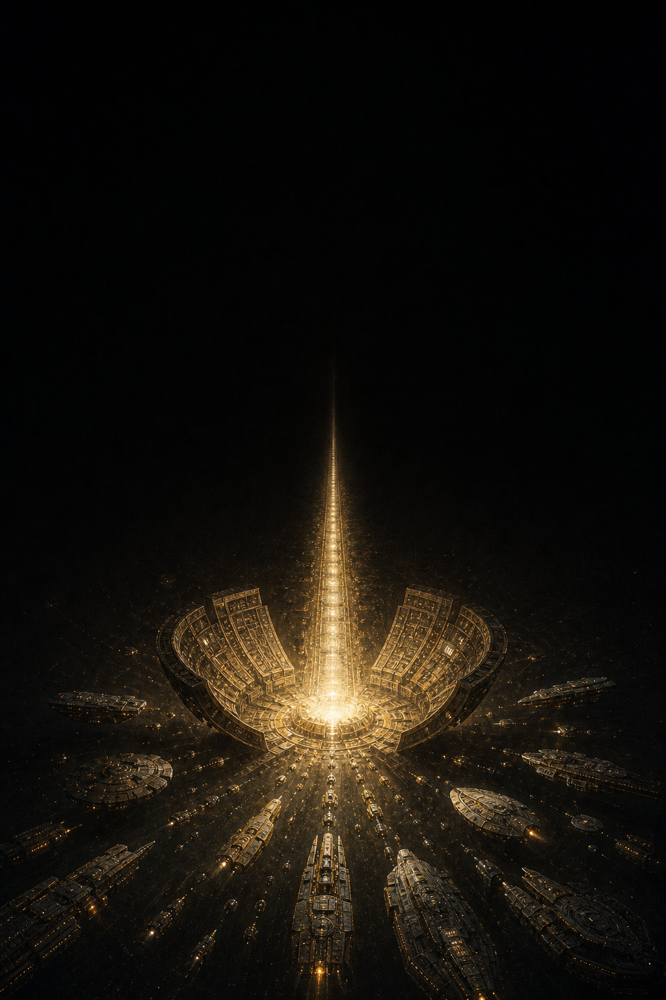

# The Premise

Status: **PROPOSED**, except where noted. This is the load-bearing document. If you change
one thing in this folder, change it here first and let the rest follow.

---

## Logline

*A galaxy that once travelled on lit, charted roads has gone blind — and the empires racing
to relight it do not know that the roads were switched off on purpose, to keep something out.*

*Inspiration poster: the Trellis failing above the command station. The black gaps are the subject;
nothing beyond the quarantine is depicted.*

---

## The paragraph

Nobody alive built the Trellis. For as long as any civilisation had records, there were
lanes between the stars — surveyed, swept, and lit by beacons called Lamps that let a ship at
superluminal speed see what lay ahead of it. Twelve species grew up on that network the way
vines grow on a frame: prosperous, interdependent, and structurally incapable of standing
without it. Then the Lamps went out. For nine days, ships in transit simply failed to arrive.
The number lost is not known, because the count was kept by the Trellis.

Three generations later, the survivors have relearned flight the hard way. A ship crossing
between stars now travels blind at the speed of light, and at that speed a gravel bank is
ordnance and a collapsed star is an unmarked grave. Every empire's map is short, expensive,
and written in wrecks. To know a route is to have survived it. To own a sector is to have
paid for the knowledge of it.

And in every capital, the same project is quietly underway: rebuild a Lamp. Relight the
lanes. Put the galaxy back the way it was.

None of them know that the Trellis did not fail. It was shut down from the inside.

---

## The one-pager

### What the player is actually doing

The player is a **Chart-Warden's commander** — the officer who decides where the empire's
next verified fact will come from, and what it will cost. Everything the game asks of you is
a version of one question: *do you spend a probe, or do you spend a fleet?*

That question is the whole game, and it is already in the code:

- A probe costs 300 crystal and buys you one sector's truth.
- A fleet crossing a shoal blind loses half its hulls. Arriving at that same shoal, decelerating
  with time to see, it loses a quarter.
- A fleet that enters a mouth — a collapsed star — is gone. No roll, no partial loss, no report.
- But a shoal you *hold* is safe forever. Survive an arrival, keep the sector, and the death
  trap becomes a supply lane and a small mine.

That last rule is the engine of the whole world. Empires do not expand by conquering; they
expand by **converting the unknown into the known, one funeral at a time.** A mature empire is
not a territory. It is a chart.

### Why the fiction had to be this

I did not invent blind FTL. It is written into `server.js` — belts roll 50% in transit and
25% on arrival, "because a ship crossing a belt is between stars at light speed and cannot
see what is in front of it." Somebody made an excellent decision there and never followed it
through. Everything above is that decision taken seriously:

| The rule in code | What it means about the world |
|---|---|
| Blind FTL, hazards on transit | Space travel is a fall, not an achievement. Something better existed. |
| Fog of war | Not a UI convention. The true state of the galaxy. |
| Probes cost crystal and can die | Knowledge is bought, and the price is paid in advance. |
| Owning a belt makes it safe | Ownership *is* knowledge. Sovereignty is cartography. |
| Black holes never roll | Some facts are only learned from who fails to come home. |
| `traceDirectRoute()` | A "trace" is the most valuable object in the setting. The code already named it. |
| Crystal pays for probes, movement, spycraft | Crystal is not treasure. It is the substance of *knowing where you are*. |
| Espionage reveals enemy sectors | You are not stealing secrets. You are stealing maps. |
| Counter-intel destroys enemy probes | You are not shooting it down. You are feeding it a false trace. |
| Scientific victory: research everything | You have reconstructed enough of the old science to relight the lanes. |
| Warp Gate is a late, expensive building | A crude, single-span imitation of the Trellis. |
| Galactic Wonder victory *(currently disabled)* | The Wonder is a **Lamp**. That's what it always was. |

Not one line of that required a mechanical change. The world was already implied. **LOCKED**,
in the sense that the code says so.

### The dramatic question

> *The galaxy was safe once. Do we want it back, or do we want to know why we lost it?*

Every victory condition is a different answer, and this is worth noticing because it means
the game's win screens are already arguing with each other:

- **Domination** — hold three-quarters of the worlds. *The galaxy is safe when I am the only
  one steering.*
- **Elimination** — be the last empire with a world. *There was never room for twelve.*
- **Economic** — accumulate 100,000 resources. *Safety is a thing you can afford.*
- **Scientific** — research every technology available to your race. *We can rebuild it. We
  don't need to know why it fell.*
- **Time** — hold the most ground when the clock runs out. *Nobody wins. Somebody is standing.*

### The turn of the knife

The campaign's job is to make the player understand, somewhere around hour fifteen, that
**the win condition is the mistake.** The Trellis was not infrastructure. It was also a road,
and roads run both ways, and something used it. Whoever shut it down did so as a quarantine,
at a cost we would call genocidal, and left no message because a message could be read by the
thing they were sealing out.

So the endgame is not "defeat the enemy." It is: *you now have the ability to relight the
galaxy, and you have just learned what that means.* And the other eleven empires are all
racing you to it, and most of them will not believe you.

**LOCKED** (2026-07-25). Chosen over entropy and theft because it converts the game's own
victory screen into the story's climax — a thing almost no strategy game manages, and which
this one gets for free because "research everything" already means "you can relight the lanes."
Reasoning and rejected alternatives are recorded in `08-open-questions.md` Q1.

**The discipline it obliges:** the thing behind the quarantine is never designed, never named,
never shown. We show its effects — a docking schedule with a gap in it — and nothing else. The
moment it acquires a shape it becomes a monster, and a monster is far less frightening than an
absence.

### What this is not

- Not grimdark. Nobody is a skull-worshipper. These are professionals doing difficult work
  in a haunted place, and most of them are decent.
- Not a chosen-one story. The player is an institution, not a messiah.
- Not comic. Wry, occasionally, in the way that people who read casualty lists for a living
  are wry. Never quippy.
- Not a mystery box. Every question raised gets an answer inside the campaign. The
  withholding is paced, not indefinite.
