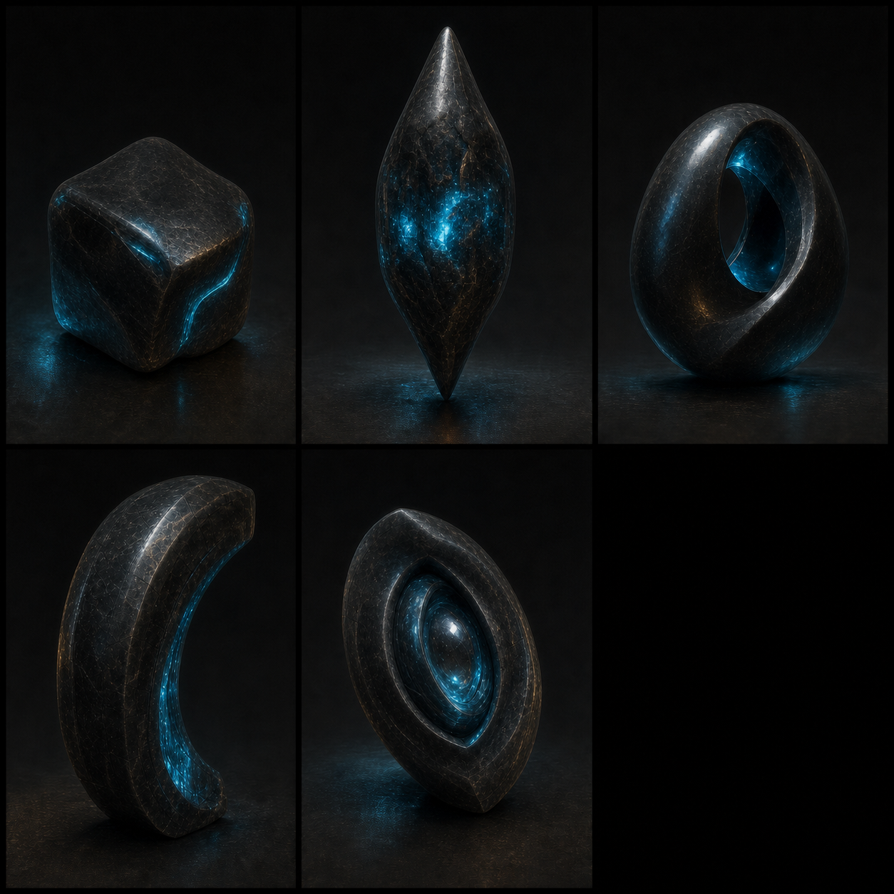
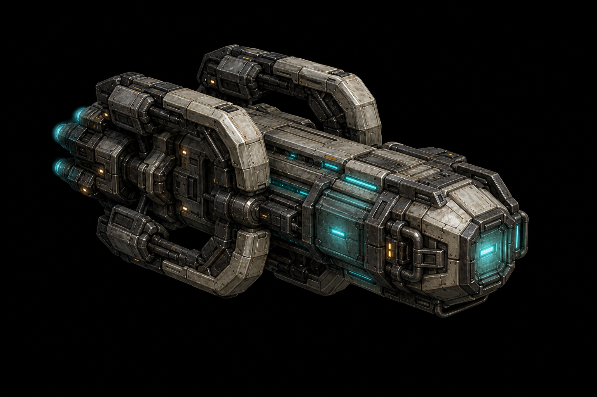

# The Unattributed, and relics

Canon state: **LOCKED** on everything the fiction depends on — see `08-open-questions.md` Q10, which is
the authority if this file and that one ever disagree.

Delivery state: **DESIGN.** None of it is built. Every number here is a placeholder and says so.

This file used to be a proposal that ended in five questions. All five were answered on 2026-07-26, and
three of the answers were better than what it recommended. Where the owner overruled the proposal, this
version says so, because knowing *which* ideas came from where is worth more later than a document that
reads as though it were always right.

---

## What this is

The species that were here millions of years before anybody, and the things they left in the ground.

The setting has been carrying a hole for them on purpose since Pass 1, and the code has been carrying the
field for them since launch:

- *"Nobody alive built the Trellis. The Ancients **maintained** it. They did not build it."* Flagged in
  `12-civilisations/09-ancients.md` as **the campaign's central revelation**.
- Ancient installations have *"doorways slightly too tall, corridors slightly too wide, treads slightly
  too deep. They were built for something, and it is not what maintains them now."*
- *"Who built the Trellis"* is on the list of five things never explained (`26-encyclopedia.md`).
- And `lib/map.js` rolls **`artifact = 1–5` on 25% of every colonizable world**, one value per world,
  persisted to the map table, where **nothing reads it**.

So this is not an addition. It is the thing three documents and one live database column were already
pointing at.

**On "millions of years."** Take it and be glad of it. A gap of millennia makes them a lost civilisation
— something you could conceivably meet, negotiate with, or fight. A gap of millions makes them
**geology**. They cannot be a faction, cannot be a diplomatic partner, and cannot arrive in act three.
That is a much better kind of absence and it protects everything else.

---

## The names

**The builders are the Unattributed.** The Registry files them under an administrative negative because
seventy-four years of scholarship has failed to produce anything better, and the fact that the galaxy's
most literate institution cannot name them is worth more than any name would be. They have no name, and
the absence is the characterisation.

This is load-bearing. **They must never be called "the Ancients."** The Ancients are race 9 — playable,
present tense, they attend councils — and the single most important distinction in the setting is that
*maintainers are not makers*. Collapse the two names and the campaign's central revelation stops being
one.

**The object is a relic.** Player-facing, and the word players will read most.

*Withdrawn: "a leaving."* That was this document's own coinage, and the owner replaced it with the
standard word. The reasoning is sound and was accepted with its cost: the setting has already spent its
coinage budget on *shoal*, *mouth*, *trace*, *reckoning* and *the Whisper*, and one more invented noun on
the most-clicked object in the game is a tax that word did not earn. Relic imports fantasy connotations
the setting has otherwise avoided; that is the price and it is worth paying for legibility.

**Nobody says "the Builders."** Or rather — everybody does, casually, and it is an assumption. We do not
actually know they built the Trellis. We know they were here first and their things are in the ground.

---

## What a relic is



Not a weapon. Not a technology. **A part.**

The justification was written before any of this conversation happened, in `24-anthology/13-wonders.md`:

> There is a drawer in cabinet forty-one and in the drawer there is a requisition form. It asks for
> eleven parts. Nine of them we can make. One of them we can make badly. **One of them nobody alive
> knows the name of, and the form does not describe it, because the person who filled in the form in
> BU 400 knew what it was and did not think to say.**

That is the relic. The Concord's documentation is complete except for the parts it assumed you already
had. **Research recovers the documentation. A relic supplies the assumption.**

Everything else follows from this: **a relic does nothing on its own, cannot be reverse-engineered, and
cannot be manufactured.** It is not a shortcut to a technology. It is the component the technology takes
for granted.

Per Law 25's discipline, **a relic is functional and unreadable.** You can use one. You cannot understand
it, and no assay has ever established what made it — not its chemistry, not its age beyond "older than
the instruments," and above all not its species. That is what keeps the Unattributed from becoming a
monster.

---

## Why the galaxy is dark — the part this settles

**A relic caused the Unarriving. Somebody used one without understanding it.**

This is the owner's answer and it is better than the one this document originally proposed. It also has
to be stated precisely, because **it refines locked Q1 rather than replacing it, and Q1 stands
unchanged**:

- **The shutdown was deliberate.** The Ancients closed the Trellis from the inside, knowing what they
  were doing, and left no message because a message can be read by the thing you are sealing out. All of
  Q1 survives word for word.
- **The breach was an accident.** Somebody dug up a relic and operated it, and that is how the lanes came
  to be running both ways in the first place.
- **The Ancients did not fire it.** They shut the doors afterwards, on purpose, and have carried it in
  silence for seventy-four years.

**Who used it is never specified** — possibly one of the twelve, possibly somebody long before them.
Naming them would manufacture the villain Q1 deliberately declined, and Law 25's discipline covers the
cause as much as the thing.

**Why this is the strongest version available.** It makes the relic mechanic the direct cause of the
setting's catastrophe rather than a decoration on it. A player who digs up a relic and bolts it into a
Wonder is not doing something *like* the original mistake. They are doing the original mistake, with
better funding and a bigger fleet. It also answers something the fiction had never explained: why the
Ancients say nothing at all when you find one. They know what one did.

**The Ancients' character does not change.** Grim custodians who made an appalling correct choice and
cannot explain it. Explicitly **not** the people who broke the galaxy by accident — that version was
considered and rejected, because it makes the best-designed race on the roster pitiable instead of
unknowable.

**What this must never do:** confirm itself on screen. No document, line of copy, or codex entry should
state that a relic caused the Unarriving. It should be *derivable* — from a relic that is the wrong shape
for a road, from the Ancients' silence, from the fact that the Bioform Collective turn out to have been
right — and never asserted.

---

## The mechanic, as decided

The owner's model, which replaced this document's. The original proposed a **per-empire relic
counter**, which made map luck a private misfortune needing a trade mechanic to soften it. The version
below makes relics **objects on the board**, and it is materially better.

| Rule | Consequence |
|---|---|
| A relic is a **physical thing on a world**, like a building — not a number in a ledger | It has a location, and locations can be taken |
| **One per world at most**, and most worlds have none | Matches the shipped generator exactly |
| Discovery odds stay **small even under heavy development** | A relic world rewards sustained investment, not a lucky turn three |
| **It transfers with the ground** | Lose the planet, lose the relic |
| Therefore **a planet becomes worth defending** | The game has never had this. Every world was interchangeable and you defended whichever was cheapest |
| An unlucky empire needs **an army**, not compensation | The trade-as-mitigation argument in the original is **withdrawn**; conquest does that work better |
| **Colonizable worlds only** | No map-generator change, no second discovery mechanism for undevelopable ground |

**Decided: you need five relics, and every relic is unique.** Not grades — explicitly rejected, so
`artifact = 1` is not a smaller relic than `artifact = 5`. Not a set of kinds to complete either; five
relics is five relics. That leaves the 1–5 value free, and the right use for it is **identity**: which of
several unique relics this world holds, for flavour and art, derived deterministically from
`(gameId, sectorId)` the way `sector-names.js` derives chart names, so uniqueness per map is automatic.

**The map is already finite, and the number is good.** Measured over 200 generations of a standard 14×8
map: **67 colonizable worlds, 16.7 relic worlds.** At five per Wonder that is **at most three Wonders per
map**, and in a six-player game most empires cannot build one without taking relics off somebody who
already has them. No new scarcity mechanism is needed.

*The line this replaced proposed reading `artifact = 1–5` as five kinds of part.*
Then "hold five relics" means one of each, and the victory condition becomes literally assembling the
mechanism. It also uses the shipped generator precisely as it already behaves.

**Deferred, not rejected:** relics on shoals and small moons. Better fiction — a relic on a rock the
Codex already calls *"worthless as ground, decisive as a position"* makes that line literally true, and a
relic in a belt means paying hulls to sweep it before you can even look. Both need a generator change and
a discovery trigger for ground nobody can build on. Good first extension; not a launch requirement.

### How discovery happens

Development, not time. The `artifact` value sits on the **world**, not the player, so the code already
supports this.

| Trigger | Why it is the right trigger |
|---|---|
| Colonising a world that holds one | Reveals *that something is there*, never what. A survey note, no relic yet |
| Each **building** completed on that world | You dug a foundation |
| Each **turn of extraction** on that world | Slow and steady, and it makes a Metal Extractor interesting beyond income |
| **Spaceport upgrade** on that world | A new slip is the deepest excavation anybody performs. Best odds |

This ties discovery to *investment*, so the reveal lands mid-game when you are committed to a world
rather than on turn three when you are not. It also gives the terraforming ladder a second meaning:
harsher worlds develop slower, so their relics surface later.

**A colonised world should show that it holds something** without saying how much. That turns an inert
database field into a reason to prefer one world over another, which is the cheapest strategic depth
available anywhere in this game. `SECTOR_STATUS.ARTIFACT` already exists in `public/js/ui.js` in cyan and
has never been used.

### Moving one



**A dedicated lifter hull, available to every race**, exempt from race doctrine exactly as the Colony
Ship already is (`races.js`: *"Colony (6) is always allowed"*).

The exemption is not a convenience. Checking "Carrier-class or larger" against `RACE_ACCESS` found that
**the Zephyr Swarm and the Shadow Realm can field neither a Carrier nor a Dreadnought** — so a
doctrine-respecting rule would have locked two of twelve races out of an entire mechanic by accident.
(For the Zephyr it was almost too apt: they refuse any hull that could be mourned, so of course they
cannot lift a relic. For the Shadow Realm it was just a tax.)

The lifter should be **expensive, slow, and defenceless**, so committing one is a real decision and
losing one in transit is a disaster.

**One consequence worth naming: this revives trade after all.** If a relic transfers with the ground and
a lifter can carry it, then flying one to another empire's world and unloading it is a gift — physical,
slow, and interceptable, with no trade menu and no new code. That is a better version of trade than the
abstract one this document originally asked for, and it makes the Star Nomad brokerage real rather than
fictional.

*An earlier version of this paragraph also claimed the lifter "rescues" the Shadow Realm's Assembled
Frame, which is described as a buy-back of eleven fragments from eleven empires. **Withdrawn — that was a
conflation.** Those eleven fragments are **frames of imagery**, pieces of a recording sold off over
seventy years, not objects in the ground. Nothing carries them and nothing needs to. The buy-back is the
story of that race's research capstone; their Wonder takes five relics like everybody else's. See Q10g.*

---

## The Wonder, and how a relic collection wins

The owner's proposal, and it turns a **dead code path** back on rather than adding a sixth victory
condition. `server/lib/victory.js` has carried this since launch:

```js
WONDER: { id: 5, enabled: false,
  description: 'Disabled until Galactic Wonder construction is implemented',
  check: ... SELECT turn_built FROM wonders${gameId} WHERE owner = ?
         turnsHeld = currentTurn - turnBuilt
         callback(turnsHeld >= 10, percentage) }
```

Build a Galactic Wonder, hold it ten turns, win. Written, switched off, waiting for a Wonder to build.

**Build time is hold time.** There is no separate hold phase after completion — the construction period
*is* the vulnerable window. One clock, not two.

- A Wonder costs **resources plus relics** and takes **multiple turns**.
- **Construction is announced to every player when it starts, including the sector.** The fiction does
  this for free and nothing has to leak: a Wonder is a Lamp being relit. It is a light. Everybody can see
  where it is. The `systemalert::` broadcast path already exists.
  - **One exception, now decided (Q10g):** the Shadow Realm's Assembled Frame **has no site**
    (`13-wonders/README.md` rule 3, where the absence is called the whole point of the race), so it
    announces **a count instead of a coordinate** — how many of its five relics are held, updated as
    that changes, never where. Harder to ignore than a sector, not softer, and the empire
    that refuses to be counted becomes the only one the galaxy counts. They are stopped by taking the
    worlds their relics sit on, of which there may be five, rather than by besieging one site.
- **Taking the sector mid-build destroys the works.** The relics transfer with the ground, so the
  attacker gains the parts and starts over. Recorded as the writer's call and open to veto: inheriting
  progress would let a rival snipe turn nine and *steal* the win, rewarding nine turns of inactivity,
  whereas destroying it means the snipe *denies* the win — which is the tension the design wants.
- This also removes a latent bug. The dormant check computes `turnsHeld = currentTurn - turnBuilt` while
  selecting on `WHERE owner = ?`, so a captor would inherit the full elapsed clock and **win instantly on
  taking a ten-turn-old Wonder.** Under build-is-hold the clock resets with the ground and the bug cannot
  arise.

### What relics gate — and what they must not

**Wonders: yes.** `13-wonders/` currently gates each Wonder behind *"the race's third signature
technology"* — a pure research gate, which means the endgame is bought with economy and nothing else and
every game's Wonder race is the same shape. A relic gate adds **geography and history**: you cannot
simply tech to a Wonder, you have to have held and developed the right ground. Two empires with identical
research can be at very different places, and the difference is *where they have been*.

It is also thematically inevitable. A Wonder is an attempt to rebuild a piece of the Trellis, and the
Trellis was the Unattributed's work. Of course you need a piece of it.

**Race-specific weapons and technologies: no.** Still this document's recommendation and unchallenged.
The signature technologies and hulls in `13-wonders/` **are** each race's identity — the Ringer *is* the
Crystalline, Deceleration Doctrine *is* the Void Walkers — and gating identity behind a find means a
player can spend a whole game unable to be who they picked. One gate is legible; two gates on the same
door is confusing, and the second one lands on the wrong object.

**A Wonder is a thing you build once, at the end, out of somebody else's leftovers. A race weapon is
yours.** Keep that distinction sharp.

---

## What the code already provides

Verified by reading it, not assumed:

| Already there | State |
|---|---|
| `lib/map.js` rolls `artifact = 1–5` on 25% of colonizable worlds, one per world, persisted | works; read by nothing |
| `SECTOR_STATUS.ARTIFACT` in `ui.js`, cyan `#40C0FF` | defined; never used |
| `wonders` table — `owner`, `type`, `turn_built` | created for every game; written by nothing. Needs a sector column |
| `WONDER` victory in `victory.js` | present, correct shape, `enabled: false` |
| `production_turn` / `production_used` per-turn production budget | live |
| `systemalert::` broadcast to all players | live |

**One notable first:** nothing in this game currently has a build time. Everything completes on payment,
gated by production capacity. A Wonder would be the first object with a duration — a reasonable place to
introduce one, since it is a single object, once per game. And it may not need a new timer at all: a
Wonder costing several hundred production drains many turns of the existing per-turn budget by itself, so
"multiple turns" can fall out of the model that already exists rather than being bolted beside it.

---

## Risks, honestly

**1. RNG on an identity object — now solved twice over.** The original risk was a low-probability roll
gating a once-per-game object, locking a player out of their own doctrine by luck. Relics-as-objects fixed the
first half; relics-as-territory fixed the second, because a player with bad luck can *take* one. If a
later balance pass ever converts relics back into a private counter, both mitigations vanish together.

**2. The dogpile.** Announcing the sector is the point, and it means the leader gets attacked. That is
intended. What must be watched is whether a Wonder build is ever *worth* starting — if the announcement
reliably kills the builder, nobody builds and the condition stays dead in a new way. This needs playing,
not reasoning about.

**3. It could turn the Ancients into a quest-giver.** It must not. Their canon is that they attend
everything and say nothing. The correct Ancient response to a player finding a relic is **one line, in
the past tense, offering nothing** — and the fact that they clearly recognise it is the whole beat.

**4. Scope.** A per-world relic object, a discovery roll on four existing events, a reveal on
colonisation, a new hull, a Wonder with a duration, a re-enabled victory condition, and the map showing
any of it. That is a real feature, not a copy change.

---

## Still open

- ~~Five kinds or five grades~~ — **decided.** Five relics, each unique, no grades and no set of kinds.
- **Every number.** Discovery odds per trigger, relics per Wonder, build duration, lifter cost and speed.
- **Whether the lifter needs art before it can ship**, and whether an existing hull silhouette can stand
  in.
- **Veto point:** works destroyed rather than inherited on capture.

## Sequencing

Nothing here should start until the delivery items already on the board are done. The honest order is:
the `artifact` reveal on the map first — it is nearly free, uses a status colour that already exists, and
makes worlds unequal before any of the rest is built. Then discovery. Then the Wonder and the victory
condition, together, because neither is worth anything alone.
