# Gameplay Icon System

Status: **REFERENCE**. The names and icons are ready for UI integration, but this folder
does not by itself change the shipped labels or controls.

This catalog contains **142 individually usable 256x256 PNG icons**:

- 108 research-level icons;
- 9 current building-state icons;
- 9 standard ship-type icons;
- 16 core gameplay-action icons.

## Display rule

Use the evocative alias as the primary label and put the real mechanic immediately beneath it.
Never make a player remember that "Fleet Foundry" means level 3. A complete card should read:

**Fleet Foundry**  
Spaceport level 3 - 32 production/turn

Aliases add setting character; canonical labels, numeric levels, requirements, and effects remain
the gameplay contract.

## Research levels

### ECONOMY

#### Metal Extraction

| Icon | Alias | Actual mechanic |
|---|---|---|
| 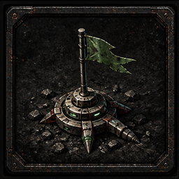 | **Surface Claims** | Metal Extraction level 1 - +10% metal income per level |
| 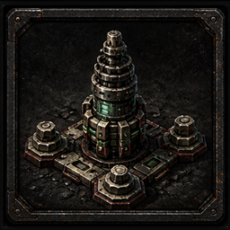 | **Standard Fasteners** | Metal Extraction level 2 - +10% metal income per level |
| 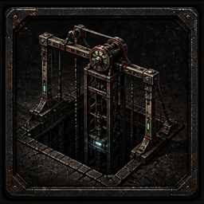 | **Deep Shafts** | Metal Extraction level 3 - +10% metal income per level |
| 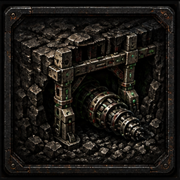 | **Load-Bearing Cuts** | Metal Extraction level 4 - +10% metal income per level |
| 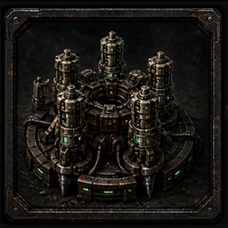 | **Automated Drills** | Metal Extraction level 5 - +10% metal income per level |
| 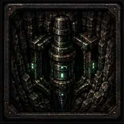 | **Pressure Mines** | Metal Extraction level 6 - +10% metal income per level |
| 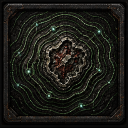 | **Seam Cartography** | Metal Extraction level 7 - +10% metal income per level |
| 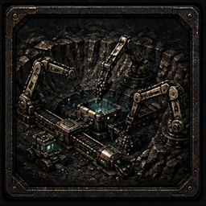 | **Autonomous Pits** | Metal Extraction level 8 - +10% metal income per level |
| 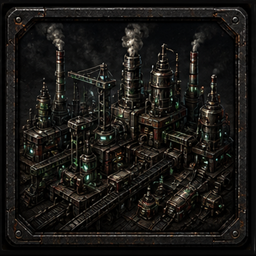 | **Planetary Works** | Metal Extraction level 9 - +10% metal income per level |
| 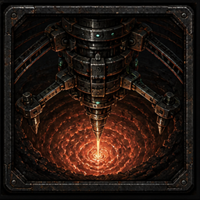 | **Coreward Extraction** | Metal Extraction level 10 - +10% metal income per level |

#### Crystal Refining

| Icon | Alias | Actual mechanic |
|---|---|---|
| 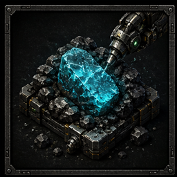 | **Raw Sorting** | Crystal Refining level 1 - +10% crystal income per level |
| 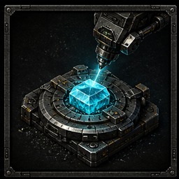 | **Clean Cut** | Crystal Refining level 2 - +10% crystal income per level |
| 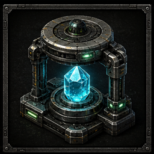 | **Optical Grading** | Crystal Refining level 3 - +10% crystal income per level |
| 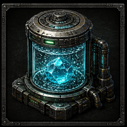 | **Resonance Wash** | Crystal Refining level 4 - +10% crystal income per level |
| 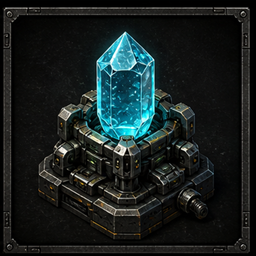 | **Instrument Stock** | Crystal Refining level 5 - +10% crystal income per level |
| 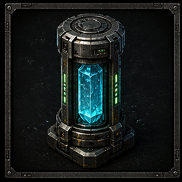 | **Reckoning Standard** | Crystal Refining level 6 - +10% crystal income per level |
| 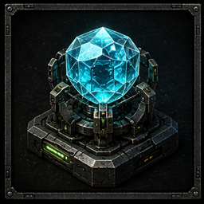 | **Lossless Facets** | Crystal Refining level 7 - +10% crystal income per level |
| 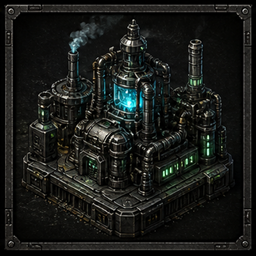 | **Deep-Grade Refining** | Crystal Refining level 8 - +10% crystal income per level |
| 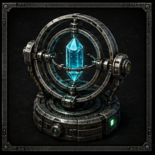 | **Concord Purity** | Crystal Refining level 9 - +10% crystal income per level |
| 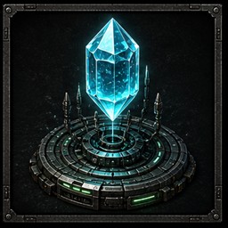 | **Perfect Reckoning** | Crystal Refining level 10 - +10% crystal income per level |

#### Research Networks

| Icon | Alias | Actual mechanic |
|---|---|---|
| 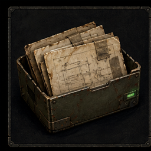 | **Recovered Papers** | Research Networks level 1 - +10% research income per level |
| 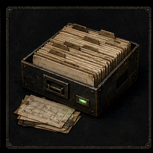 | **Shared Index** | Research Networks level 2 - +10% research income per level |
| 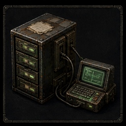 | **Relay Library** | Research Networks level 3 - +10% research income per level |
| 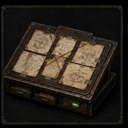 | **Concordance Office** | Research Networks level 4 - +10% research income per level |
| 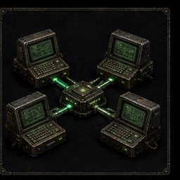 | **Distributed Academy** | Research Networks level 5 - +10% research income per level |
| 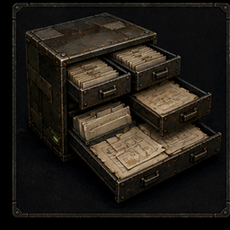 | **Open Archive** | Research Networks level 6 - +10% research income per level |
| 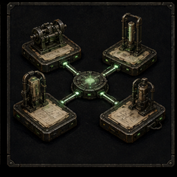 | **Cross-World Method** | Research Networks level 7 - +10% research income per level |
| 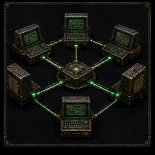 | **Live Peer Network** | Research Networks level 8 - +10% research income per level |
| 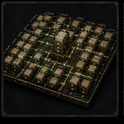 | **Total Bibliography** | Research Networks level 9 - +10% research income per level |
| 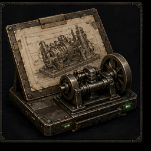 | **Reconstructed Practice** | Research Networks level 10 - +10% research income per level |

### WEAPONS

#### Laser Weapons

| Icon | Alias | Actual mechanic |
|---|---|---|
| 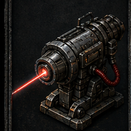 | **First Gun** | Laser Weapons level 1 - +10% fleet damage per level |
| 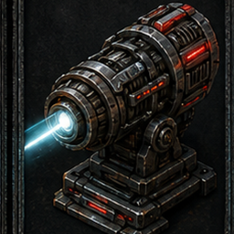 | **Stabilized Emitter** | Laser Weapons level 2 - +10% fleet damage per level |
| 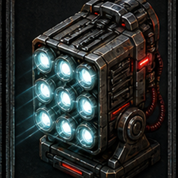 | **Coherent Array** | Laser Weapons level 3 - +10% fleet damage per level |
| 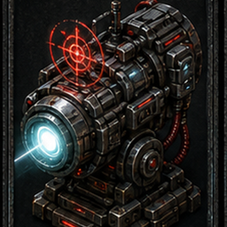 | **Predictive Tracking** | Laser Weapons level 4 - +10% fleet damage per level |
| 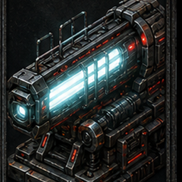 | **Steady Service** | Laser Weapons level 5 - +10% fleet damage per level |

#### Plasma Cannons

| Icon | Alias | Actual mechanic |
|---|---|---|
| 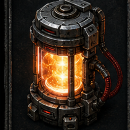 | **Magnetic Bottle** | Plasma Cannons level 1 - +15% fleet damage per level |
| 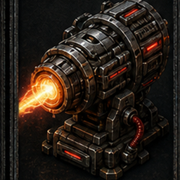 | **Pulsed Bolt** | Plasma Cannons level 2 - +15% fleet damage per level |
| 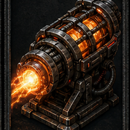 | **Wound Channel** | Plasma Cannons level 3 - +15% fleet damage per level |
| 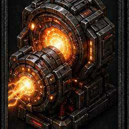 | **Cascade Chamber** | Plasma Cannons level 4 - +15% fleet damage per level |
| 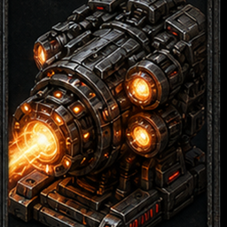 | **Starfire Battery** | Plasma Cannons level 5 - +15% fleet damage per level |

#### Antimatter Warheads

| Icon | Alias | Actual mechanic |
|---|---|---|
| 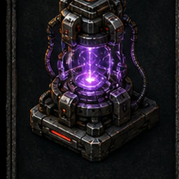 | **Pinch Containment** | Antimatter Warheads level 1 - +25% fleet damage per level |
| 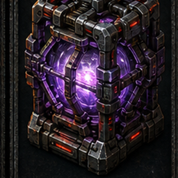 | **Caged Void** | Antimatter Warheads level 2 - +25% fleet damage per level |
| 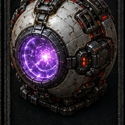 | **Zero-Contact Warhead** | Antimatter Warheads level 3 - +25% fleet damage per level |

### MISSILES

#### Rocketry

| Icon | Alias | Actual mechanic |
|---|---|---|
| 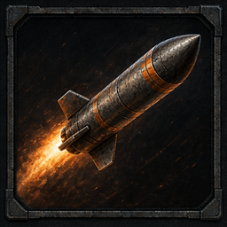 | **Volume Aim** | Rocketry level 1 - Partially bypasses enemy shields per level |
| 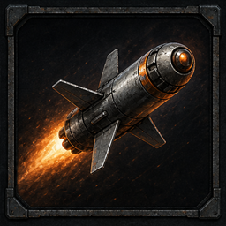 | **Guided Salvo** | Rocketry level 2 - Partially bypasses enemy shields per level |
| 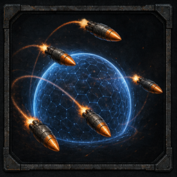 | **Shield-Bypass Doctrine** | Rocketry level 3 - Partially bypasses enemy shields per level |

#### Hyper-V Missiles

| Icon | Alias | Actual mechanic |
|---|---|---|
| 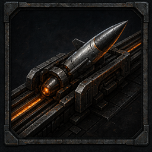 | **Acceleration Rail** | Hyper-V Missiles level 1 - Heavy shield-piercing ordnance |
| 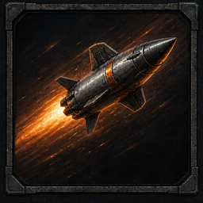 | **Terminal Correction** | Hyper-V Missiles level 2 - Heavy shield-piercing ordnance |
| 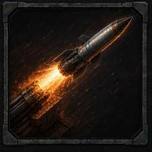 | **Irrevocable Flight** | Hyper-V Missiles level 3 - Heavy shield-piercing ordnance |

### ARMOR

#### Reinforced Hulls

| Icon | Alias | Actual mechanic |
|---|---|---|
| 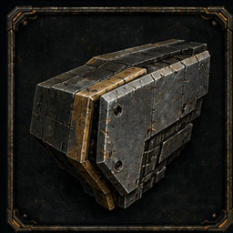 | **Two-Centimetre Plate** | Reinforced Hulls level 1 - +10% ship durability per level |
|  | **Braced Spine** | Reinforced Hulls level 2 - +10% ship durability per level |
|  | **Compartmental Frame** | Reinforced Hulls level 3 - +10% ship durability per level |
|  | **Fortress Keel** | Reinforced Hulls level 4 - +10% ship durability per level |
|  | **Yard-Four Standard** | Reinforced Hulls level 5 - +10% ship durability per level |

#### Reactive Armor

| Icon | Alias | Actual mechanic |
|---|---|---|
|  | **Ablative Skin** | Reactive Armor level 1 - +15% ship durability per level |
|  | **Layered Sacrifice** | Reactive Armor level 2 - +15% ship durability per level |
|  | **Reactive Cells** | Reactive Armor level 3 - +15% ship durability per level |
|  | **Shaped Countercharge** | Reactive Armor level 4 - +15% ship durability per level |
|  | **Battle-Shedding Armor** | Reactive Armor level 5 - +15% ship durability per level |

#### Adaptive Plating

| Icon | Alias | Actual mechanic |
|---|---|---|
|  | **Sensor Plate** | Adaptive Plating level 1 - +25% ship durability per level |
|  | **Learning Laminate** | Adaptive Plating level 2 - +25% ship durability per level |
|  | **Second-Shot Plating** | Adaptive Plating level 3 - +25% ship durability per level |

### SHIELDS

#### Deflector Shields

| Icon | Alias | Actual mechanic |
|---|---|---|
|  | **Near-Miss Field** | Deflector Shields level 1 - Makes enemy shots more likely to miss per level |
|  | **Vector Bias** | Deflector Shields level 2 - Makes enemy shots more likely to miss per level |
|  | **Deflection Grid** | Deflector Shields level 3 - Makes enemy shots more likely to miss per level |
|  | **Layered Envelope** | Deflector Shields level 4 - Makes enemy shots more likely to miss per level |
|  | **Missing by Design** | Deflector Shields level 5 - Makes enemy shots more likely to miss per level |

#### Phase Shields

| Icon | Alias | Actual mechanic |
|---|---|---|
|  | **Phase Offset** | Phase Shields level 1 - Advanced deflection that stacks with Deflector Shields |
|  | **Split Envelope** | Phase Shields level 2 - Advanced deflection that stacks with Deflector Shields |
|  | **Conditional Screen** | Phase Shields level 3 - Advanced deflection that stacks with Deflector Shields |
|  | **Silent Interval** | Phase Shields level 4 - Advanced deflection that stacks with Deflector Shields |

### PROPULSION

#### Ion Drives

| Icon | Alias | Actual mechanic |
|---|---|---|
|  | **Ion Torch** | Ion Drives level 1 - -8% fleet movement cost per level |
|  | **Field Shaping** | Ion Drives level 2 - -8% fleet movement cost per level |
|  | **Eight-Percent Drive** | Ion Drives level 3 - -8% fleet movement cost per level |
|  | **Sustained Burn** | Ion Drives level 4 - -8% fleet movement cost per level |
|  | **Fleet Economy** | Ion Drives level 5 - -8% fleet movement cost per level |

#### Warp Drives

| Icon | Alias | Actual mechanic |
|---|---|---|
|  | **Blind Geometry** | Warp Drives level 1 - A further -8% fleet movement cost per level |
|  | **Fold Calibration** | Warp Drives level 2 - A further -8% fleet movement cost per level |
|  | **Last Honest Improvement** | Warp Drives level 3 - A further -8% fleet movement cost per level |

### SHIPS

#### Military Shipyards

| Icon | Alias | Actual mechanic |
|---|---|---|
|  | **Line Yard** | Military Shipyards level 1 - Unlocks heavier ship classes |
|  | **Heavy Slip** | Military Shipyards level 2 - Unlocks heavier ship classes |
|  | **Grand Yard** | Military Shipyards level 3 - Unlocks heavier ship classes |

### ORBITAL

#### Orbital Engineering

| Icon | Alias | Actual mechanic |
|---|---|---|
|  | **Gate Geometry** | Orbital Engineering level 1 - Level 1 unlocks Warp Gates; turrets gain +20% power per level |
|  | **Targeting Lattice** | Orbital Engineering level 2 - Level 1 unlocks Warp Gates; turrets gain +20% power per level |
|  | **Hardened Battery** | Orbital Engineering level 3 - Level 1 unlocks Warp Gates; turrets gain +20% power per level |
|  | **Defense Network** | Orbital Engineering level 4 - Level 1 unlocks Warp Gates; turrets gain +20% power per level |
|  | **Orbital Command** | Orbital Engineering level 5 - Level 1 unlocks Warp Gates; turrets gain +20% power per level |

### TERRAFORM

#### Terraforming

| Icon | Alias | Actual mechanic |
|---|---|---|
|  | **Seal and Scrub** | Terraforming level 1 - Allows colonization at or below the researched requirement |
|  | **Pressure Chain** | Terraforming level 2 - Allows colonization at or below the researched requirement |
|  | **Open-Air Tolerance** | Terraforming level 3 - Allows colonization at or below the researched requirement |
|  | **Living Weather** | Terraforming level 4 - Allows colonization at or below the researched requirement |
|  | **Nobody Alive** | Terraforming level 5 - Allows colonization at or below the researched requirement |

### INTEL

#### Espionage Networks

| Icon | Alias | Actual mechanic |
|---|---|---|
|  | **Port Rumours** | Espionage Networks level 1 - Out-spy an empire to reveal increasingly sensitive intelligence |
|  | **Paid Hands** | Espionage Networks level 2 - Out-spy an empire to reveal increasingly sensitive intelligence |
|  | **Provisioning Ledger** | Espionage Networks level 3 - Out-spy an empire to reveal increasingly sensitive intelligence |
|  | **Rubbed-Out Charts** | Espionage Networks level 4 - Out-spy an empire to reveal increasingly sensitive intelligence |
|  | **Bought Traces** | Espionage Networks level 5 - Out-spy an empire to reveal increasingly sensitive intelligence |
|  | **Reading Their Charts** | Espionage Networks level 6 - Out-spy an empire to reveal increasingly sensitive intelligence |
|  | **Fleet Ledgers** | Espionage Networks level 7 - Out-spy an empire to reveal increasingly sensitive intelligence |
|  | **Inner Registry** | Espionage Networks level 8 - Out-spy an empire to reveal increasingly sensitive intelligence |

#### Counter-Intelligence

| Icon | Alias | Actual mechanic |
|---|---|---|
|  | **Quiet Audit** | Counter-Intelligence level 1 - Blinds enemy intelligence; sufficient advantage destroys probes |
|  | **Closed Ledger** | Counter-Intelligence level 2 - Blinds enemy intelligence; sufficient advantage destroys probes |
|  | **Probe Intercept** | Counter-Intelligence level 3 - Blinds enemy intelligence; sufficient advantage destroys probes |
|  | **Salting** | Counter-Intelligence level 4 - Blinds enemy intelligence; sufficient advantage destroys probes |
|  | **False Provenance** | Counter-Intelligence level 5 - Blinds enemy intelligence; sufficient advantage destroys probes |
|  | **Blind Office** | Counter-Intelligence level 6 - Blinds enemy intelligence; sufficient advantage destroys probes |
|  | **Hostile Silence** | Counter-Intelligence level 7 - Blinds enemy intelligence; sufficient advantage destroys probes |
|  | **Unreadable Empire** | Counter-Intelligence level 8 - Blinds enemy intelligence; sufficient advantage destroys probes |

## Buildings and upgrades

Only the Spaceport has a shipped level progression. Metal Extractors, Crystal Refineries,
Research Academies, and Orbital Turrets are repeated installations; presenting their count as a
level would describe mechanics the game does not have.

| Icon | Alias | Actual |
|---|---|---|
|  | **Seamhead Extractor** | Building type 0; repeated installation, not a level |
|  | **Reckoning Refinery** | Building type 1; repeated installation, not a level |
|  | **Recovery Academy** | Building type 2; repeated installation, not a level |
|  | **Field Spaceport** | Spaceport level 1; 12 production per turn |
|  | **Expanded Yard** | Spaceport level 2; 20 production per turn |
|  | **Fleet Foundry** | Spaceport level 3; 32 production per turn |
|  | **Grand Fleetworks** | Spaceport level 4; 48 production per turn |
|  | **Sector Battery** | Building type 4; repeated installation, not a level |
|  | **Blindspan Gate** | Building type 5; one per sector |

## Ships

The aliases come from the hull fiction where possible. The canonical hull name must remain visible
because ship access, costs, production, and combat all use the numeric ship type.

| Icon | Alias | Actual |
|---|---|---|
|  | **First Line** | Frigate - Ship type 1; no shipyard research required |
|  | **Middleweight** | Destroyer - Ship type 2; Military Shipyards level 1 |
|  | **Cheapest Fact** | Scout - Ship type 3; no shipyard research required |
|  | **Commitment** | Cruiser - Ship type 4; Military Shipyards level 1 |
|  | **Line of Battle** | Battleship - Ship type 5; Military Shipyards level 2 |
|  | **Seedship** | Colony Ship - Ship type 6; no shipyard research required; consumed on settlement |
|  | **War-Ender** | Dreadnought - Ship type 7; Military Shipyards level 3 |
|  | **Unlisted Knife** | Intruder - Ship type 8; Military Shipyards level 2 |
|  | **Recovery Harbour** | Carrier - Ship type 9; Military Shipyards level 3; requires a local Warp Gate |

## Gameplay actions

These are the player-facing verbs currently exposed by the active game. Battle is a consequence of
movement, not a separate command, so it does not receive a misleading "attack" action icon.

| Icon | Alias | Actual |
|---|---|---|
|  | **Read the Contact** | Inspect selected sector |
|  | **Buy One Fact** | Send probe; costs 300 crystal |
|  | **Plot the Blind Line** | Request fleet movement options and route preflight |
|  | **Commit the Crossing** | Move selected fleet |
|  | **Take the Lit Span** | Move between paired owned Warp Gates |
|  | **Settle This World** | Colonize selected eligible world; consumes one Colony Ship |
|  | **Raise an Installation** | Construct selected building |
|  | **Cut the Next Slip** | Upgrade local Spaceport one level |
|  | **Lay Down a Hull** | Build selected ship at local Spaceport |
|  | **Recover the Method** | Research the next technology level |
|  | **File the Turn** | Mark ready for the next turn |
|  | **Leave Written Orders** | Configure standing orders |
|  | **Run Orders Now** | Apply standing orders immediately |
|  | **Write It on the Chart** | Choose the permanent curated name for a swept shoal |
|  | **Use the Whisper** | Send game chat |
|  | **Strike the Registry** | Surrender and remove this empire from the match |

## Asset organization

- `catalog.json` is the machine-readable naming and mechanic map.
- `icons/` contains the 142 individual 256x256 PNGs intended for UI use.
- `atlases/` preserves the generated source sheets and their visual progression.
- `PROMPTS.md` records the built-in image-generation prompt set.
- `tools/build-icon-assets.ps1` deterministically rebuilds individual icons and this catalog from
  the source atlases.

The PNGs have opaque command-station frames rather than transparency. This keeps small icons legible
over the existing dark UI and avoids fragile alpha edges. If the UI later needs frameless glyphs,
derive those from the individual icons as a separate production pass.

## Verification sources

- Research definitions: `../../../server/lib/tech.js` and its byte-identical client copy.
- Building costs and Spaceport tiers: `../../../server/server.js` and `../../../public/js/build.js`.
- Ship types and combat stats: `../../../server/lib/combat.js`.
- Player commands: `../../../docs/agents/server/websocket-protocol.md` and the active game controls.
- Fictional names: `../../24-anthology/02-hulls.md` through `../../24-anthology/10-spying.md`.
- Shared visual language: `../../../docs/art-direction/` and `../`.
